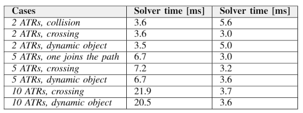
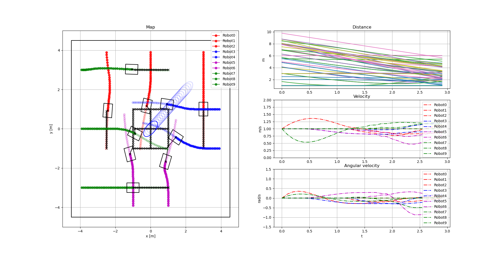

# Fleet-coordination
This project aimed to control a fleet of mobile wheeled robots using Non-Linear Model Predictive Control. The individual trajectories for each robots where assumed to be given and they should be altered such that there are no collisions with other robots, static- and dynamic obstacles. Both a centralized and a distributed schemes where compared and both showed promising results. The solve times for each iteration and a number of different cases can be seen in the table. The complexity of the centralized approach wrt to the number of robots points to 






## Install dependencies
To solve the optimization problem in the MPC-formulation the open source solver [OpEn](https://alphaville.github.io/optimization-engine/docs/installation) is used. The solver is implemented using Rust which can be installed by following the guide on their webpage [Rust](https://www.rust-lang.org/tools/install). 

Anaconda will be used as the package manager of this project, install anaconda according to the instructions on their webpage [Anaconda](https://www.anaconda.com/products/individual). Clone this repository and create the conda enviroment according to the following commands. 

```
conda env create -f env/env_slim.yml
```
